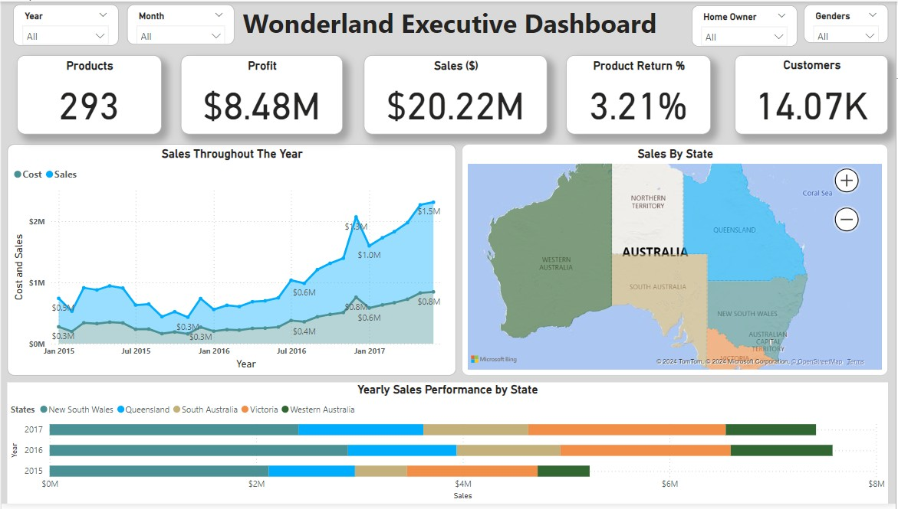
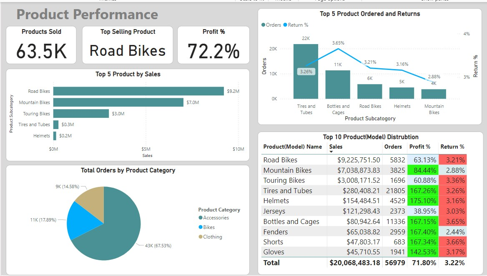
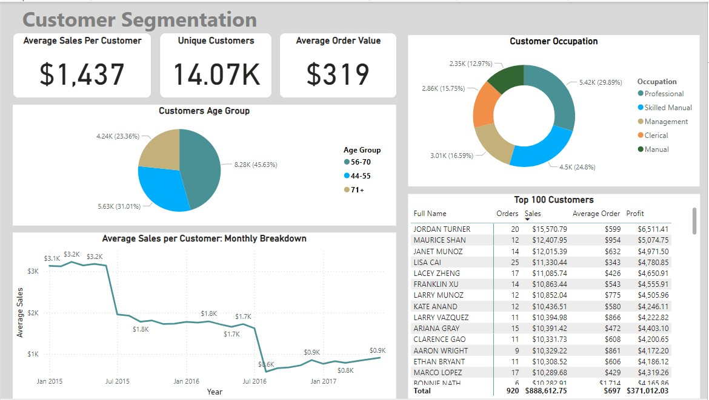

# **Wonderland Sales Analytics Dashboard**

## **Project Overview**
This project involves designing a comprehensive sales analytics dashboard for Wonderland, a fictional Australian company, using mock datasets provided as part of a case study. The dashboard aims to provide actionable insights for senior executives (CEO, CMO) to make data-driven decisions on sales trends, product performance, customer segmentation, and return analysis. The project integrates **SQL for data preparation** and **Power BI for visualisation**.

---

## **Objective**
- To analyse sales performance across states, products, and customer demographics from 2015–2017.
- To highlight high-profit products, customer segments, and potential areas for cost reduction.
- To demonstrate advanced data preparation and visualisation techniques.

---

## **Dataset Details**
The dataset includes nine mock files that encompass customer information, sales data, product details, and regional mappings:

1. **Customers.csv**: Customer demographics and personal information.
2. **Product_Categories.csv**: High-level product categories.
3. **Product_Subcategories.csv**: Detailed product subcategories and their mappings to categories.
4. **Products.csv**: Detailed product information, including cost, price, and descriptions.
5. **State_Mapping.csv**: Mapping of sales territories to Australian states.
6. **Product_Sales_2015.csv**: Sales data for 2015.
7. **Product_Sales_2016.csv**: Sales data for 2016.
8. **Product_Sales_2017.csv**: Sales data for 2017.
9. **Product_Returns.csv**: Information on product returns.

---

## **Key Features**

### **State Performance Analysis**
- Identified **New South Wales** as the top-performing state with $7M in sales.
- Highlighted Queensland’s YoY growth, indicating future opportunities.

### **Product Profitability**
- **Mountain Bikes** achieved the highest profit margin at **84.44%**.
- Accessories like **Helmets (175%)** and **Gloves (142%)** were top performers.
- Notable return rates for **Shorts (3.66%)** and **Tires and Tubes (3.26%)** were analyzed.

### **Customer Segmentation**
- The **56–70 age group** (45.63%) and **Professionals (29.89%)** were identified as the largest contributors to revenue.

### **Return Analysis**
- Suggested strategies to reduce return rates for frequently returned products.

---

## **Process and Tools**

### **Data Preparation (SQL)**
- Cleaned, transformed, and merged datasets using SQL scripts.
- Addressed missing values and inconsistencies to ensure data quality.
- Performed complex joins to combine sales, customer, and product data.

### **Data Visualization (Power BI)**
- Built a dynamic, user-friendly dashboard using only **default visuals**.
- Created KPIs, trend lines, and interactive visualizations to display insights.

### **Exploratory Data Analysis (EDA)**
- Analyzed sales trends, customer demographics, and return patterns.
- Highlighted correlations between product performance and returns.

---

## **Key Files in Repository**

1. **Data Files**:
   - All nine `.csv` files used for the analysis.

2. **SQL Scripts**:# Wonderland Sales Analytics Dashboard

A sales analytics case study built for Wonderland, a fictional Australian company. I worked with nine mock datasets covering sales, customers, products, and returns from 2015 to 2017. The goal was to surface actionable insights for senior executives around sales performance, product profitability, customer segments, and return patterns using SQL for data preparation and Power BI for visualisation.

---

## Table of Contents

- [Overview](#overview)
- [Dataset](#dataset)
- [Technologies Used](#technologies-used)
- [Installation](#installation)
- [Usage](#usage)
- [Analysis & Visualizations](#analysis--visualizations)
- [Conclusion](#conclusion)
- [Credits](#credits)
- [License](#license)

---

## Overview

- **Motivation:** I wanted to work through a realistic end-to-end analytics scenario that required both structured data preparation and executive-level reporting. A multi-year sales dataset for a fictional company gave me the freedom to build something polished without being constrained by real data sensitivity issues.
- **Objective:** The main questions I set out to answer were: which states and products drive the most revenue and profit, who are the highest-value customer segments, and where are returns creating problems for the business?
- **Learning Outcomes:** This project sharpened my SQL data pipeline skills and showed me how much cleaner the Power BI build becomes when the transformation work is done properly upfront. I also got more deliberate about designing dashboards for a specific audience, in this case C-suite stakeholders who need clarity over detail.

---

## Dataset

The dataset consists of nine mock CSV files provided as part of a case study:

- **Source:** Mock/fictional dataset (case study provided)
- **Coverage:** Sales transactions spanning 2015, 2016, and 2017
- **Files included:**
  - `Customers.csv` - customer demographics including age, occupation, income, and home ownership
  - `Product_Categories.csv` - high-level product categories (Bikes, Accessories, Clothing)
  - `Product_Subcategories.csv` - subcategory mappings to parent categories
  - `Products.csv` - product details including cost, price, and model descriptions
  - `State_Mapping.csv` - mapping of territory keys to Australian states
  - `Product_Sales_2015.csv`, `Product_Sales_2016.csv`, `Product_Sales_2017.csv` - annual order records
  - `Product_Returns.csv` - return transactions with quantity and territory detail
- **Preprocessing:** All nine files were cleaned and merged using SQL Server. Steps included null checks across every column, duplicate detection, fixing encoded fields (gender, marital status, home ownership), engineering an age bin column from birth dates, calculating per-product profit, combining all three sales years into a single unified table, and building a date reference table for time intelligence in Power BI.

---

<h2>Technologies Used</h2>

<ul>
  <li><strong>Languages:</strong> SQL (SQL Server)</li>
  <li><strong>Tools:</strong> Power BI Desktop, VS Code, GitHub</li>
  <li><strong>Data Visualisation:</strong> Power BI (default visuals only)</li>
</ul>

<p>
  
  
  
  
</p>

---

## Installation

```bash
# Clone the repository
git clone https://github.com/M-Bhurtel/Wonderland-Sales-Analaytics.git

# Navigate to the project folder
cd Wonderland-Sales-Analaytics
```

To run the SQL scripts you will need SQL Server with bulk insert permissions enabled. Before running, open `Bulk Insert all tabels.sql` and update the file paths to match where you have saved the CSV files locally.

To open the dashboard you will need **Power BI Desktop**, which is a free download from Microsoft.

---

## Usage

1. Run `Bulk Insert all tabels.sql` to create the `Sales` database and load all nine CSV files into their respective tables.
2. Run `Data Preparition of all Tables Sales.sql` to clean, transform, and produce the final tables (`Final_Customers`, `Final_Products`, `Final_Sales`, `DateReference`) used by the dashboard.
3. Open `Sales Dashboard.pbix` in Power BI Desktop.
4. Refresh the data source connection if prompted, and all three dashboard pages will load.

---

## Analysis & Visualizations

### Executive Summary



Across the full three-year period, the business generated **$20.22M in total sales** and **$8.48M in profit** across 293 products and 14,070 customers. The overall product return rate sat at 3.21%. Sales grew consistently year on year, with the steepest growth visible heading into 2017. New South Wales was the top-performing state, with Queensland showing the strongest year-on-year growth trajectory.

---

### Product Performance



Road Bikes led by revenue at $9.2M, followed by Mountain Bikes at $7M and Touring Bikes at $3M. However, Mountain Bikes had the highest profit margin in the bikes category at **84.44%**, while accessories punched well above their weight: Tires and Tubes at 167.26%, Helmets at 175.10%, Bottles and Cages at 167.15%, and Gloves at 142.53%.

Bikes made up the bulk of total orders at 67.53%, with accessories at 17.89% and clothing at 14.58%. On the returns side, Shorts had the highest return rate at 3.66%, followed by Bottles and Cages at 3.65% and Touring Bikes at 3.36%, all of which are worth monitoring.

---

### Customer Segmentation



Average sales per customer came in at $1,437 with an average order value of $319. The 56-70 age group was the dominant segment at 45.63% of orders, followed by the 71+ group at 23.36%. By occupation, Professionals led at 29.89%, followed by Skilled Manual at 24.8%. The top customer, Jordan Turner, placed 20 orders totalling $15,570 with a profit contribution of $6,511.

---

## Conclusion

The analysis confirmed that a small number of products and customer segments account for the majority of revenue and profit. Mountain Bikes and high-margin accessories are the standout performers and should be prioritised in any product or marketing strategy. The 56-70 age group and the Professional occupation segment are clearly the core customer base, with direct implications for targeting and communications.

Return rates on Shorts, Bottles and Cages, and Touring Bikes are worth investigating further, whether that points to a product quality issue, a description mismatch, or something else entirely. Queensland's YoY growth is a signal worth acting on from a regional investment perspective.

Possible next steps include building a forecasting layer on top of the existing trends, incorporating customer-level return behaviour into the segmentation model, and expanding the state analysis to include profitability rather than just revenue volume.

---

## Credits

- **Dataset Source:** Mock dataset provided as part of a data visualisation case study
- **Tools:** Microsoft SQL Server, Microsoft Power BI Desktop

---

## License

This project is licensed under the [MIT License](https://choosealicense.com/licenses/mit/) - feel free to use and modify it.

---

<p align="center"><strong>Thanks for visiting!</strong></p>
